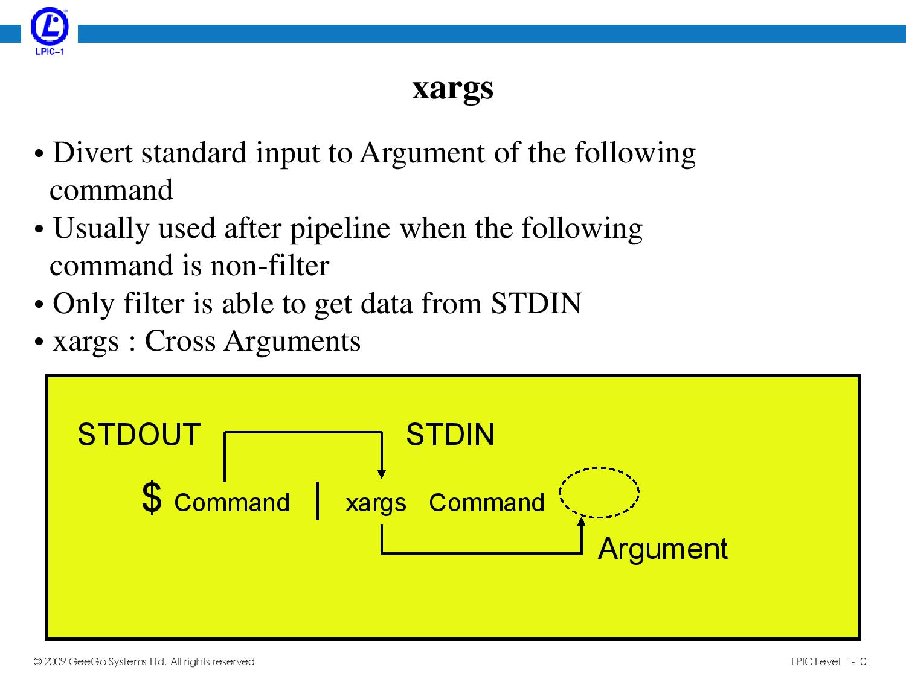
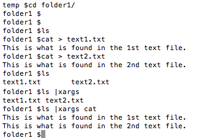

# Learn command line

Please follow and complete the free online [Command Line Crash Course
tutorial](http://cli.learncodethehardway.org/book/). This is a great,
quick tutorial. Each "chapter" focuses on a command. Type the commands
you see in the _Do This_ section, and read the _You Learned This_
section. Move on to the next chapter. You should be able to go through
these in a couple of hours.

---

###Q1.  Cheat Sheet of Commands  

Make a cheat sheet for yourself: a list of at least **ten** commands and what they do, focused on things that are new, interesting, or otherwise worth remembering.

>
| Quick Explanation                                                                                                                       | Comand Line Prompt             | 
|-----------------------------------------------------------------------------------------------------------------------------------------|--------------------| 
| print working directory                                                                                                                 | pwd                | 
| my computer's network name                                                                                                              | hostname           | 
| make directory                                                                                                                          | mkdir              | 
| change directory                                                                                                                        | cd                 | 
| list directory                                                                                                                          | ls                 | 
| remove directory                                                                                                                        | rmdir              | 
| push directory                                                                                                                          | pushd              | 
| pop directory                                                                                                                           | popd               | 
| copy a file or directory                                                                                                                | cp                 | 
| move or rename a file or directory                                                                                                      | mv                 | 
| page through a file in a separate full screen                                                                                           | less               | 
| print the whole file within the terminal                                                                                                | cat                | 
| execute arguments                                                                                                                       | xargs              | 
| find files                                                                                                                              | find               | 
| find things inside files                                                                                                                | grep               | 
| read a manual page                                                                                                                      | man                | 
| find what man page is appropriate                                                                                                       | apropos            | 
| look at your environment                                                                                                                | env                | 
| print some arguments                                                                                                                    | echo               | 
| export/set a new environment variable                                                                                                   | export             | 
| exit the shell                                                                                                                          | exit               | 
| DANGER! become super user root DANGER!                                                                                                  | sudo               | 
| switch user                                                                                                                             | su                 | 
| change permission modifiers                                                                                                             | chmod              | 
| change ownership                                                                                                                        | chown              | 
| lists all the files in a given directory + hidden files                                                                                 | ls -a              | 
| lists all the files in a given directory + (Unix file types, permissions, number of hard links, owner, group, size, last-modified date) | ls -l              | 
| same as ls -l but w/ 'human readonable' file sizes ("748B" instead of "748")                                                            | ls -lh             | 
| same as ls but sorts by most recent modification time                                                                                   | ls -t              | 
| lists all the file - but the folders are a different color and have a “/“ at the end                                                    | ls                 | 
| lists all the files in a given directory, 1 per line                                                                                    | ls -1              | 
| lists all the files in a given directory + subdirectories                                                                               | ls -R              | 
| lists files and folders in a single line, with commas separating names                                                                  | ls -m              | 
| same as ls but outputs across rows, instead of by columns                                                                               | ls -x              | 
| create new file (on UNIX)                                                                                                               | touch              | 
| shows disk usage                                                                                                                        | du                 | 
| sorts results                                                                                                                           | sort               | 
| sorts results in reverse order                                                                                                          | sort -r            | 
| provides the only the top 10 lines of a result (by default at leas)                                                                     | head               | 
| standard input - inputs the thing on the right, into the thing on the left                                                              | <                  | 
| standard output - sends the output of the thing on the left to the thing on the right                                                   | >                  | 
| standard output - appends the right with the the output of the thing on the left                                                        | >>                 |  
| matches anything in a wildcard                                                                                                          | *                  | 
| used to abort a process (i.e. because it may be going for a long time)                                                                  | ctrl + C           | 
| The quickest way to spontaneously create a file and write text into it.                                                                 | "cat > newfile.txt | 
| grep, but not case sensitive                                                                                                            | grep -i            | 

---

###Q2.  List Files in Unix   

What do the following commands do:  
`ls`  
`ls -a`  
`ls -l`  
`ls -lh`  
`ls -lah`  
`ls -t`  
`ls -Glp`  

* `ls` : lists all the files in a given directory ("list directory")
* `ls -a` : lists all the files in a given directory + hidden file
* `ls -l` : lists all the files in a given directory + (Unix file types, permissions, number of hard links, owner, group, size, last-modified date
* `ls -lh`: same as ls -l but w/ 'human readonable' file sizes ("748B" instead of "748"
* `ls -lah` : same as ls -lh but also including hidden file
* `ls -t`: same as ls but sorts by most recent modification tim
* `ls -Glp` : same as ls -l, but the "G" color codes the folders a different color, and the "p" adds a "/" at the end of the

---

###Q3.  More List Files in Unix  

Explore these other [ls options](http://www.techonthenet.com/unix/basic/ls.php) and pick 5 of your favorites:

* `ls -1` : lists all the files in a given directory, 1 per lin
* `ls -R` : lists all the files in a given directory + subdirectorie
* `ls -l` : same as ls -l but without the owner's nam
* `ls -m`: display names in a single line, with commas separating name
* `ls -x` : same as ls but outputs across rows, instead of by column

---

###Q4.  Xargs   

What does `xargs` do? Give an example of how to use it.

> xargs is used to 'package up' a set multiple outputs to be sent as an input into a subsequent command. 

> The picture in blue provides a good diagram:
> 
> 

> An example of this is the following:
> temp $ls *.txt |xargs cat
 
> This takes all the text files in the given directory, and prints out its contents (cat) one by one. 

> The following sequence of commands shows how this is done step by step:
>

